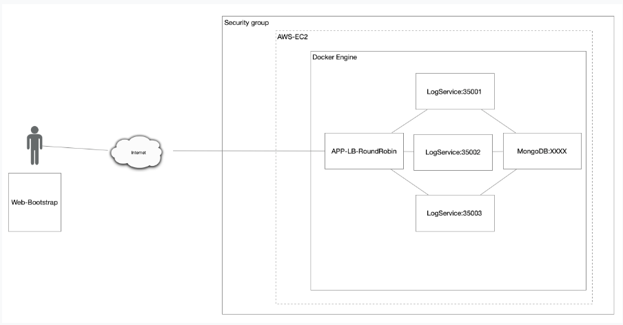
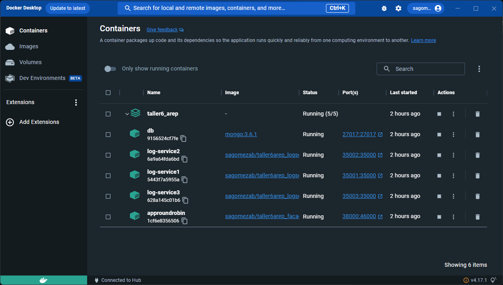
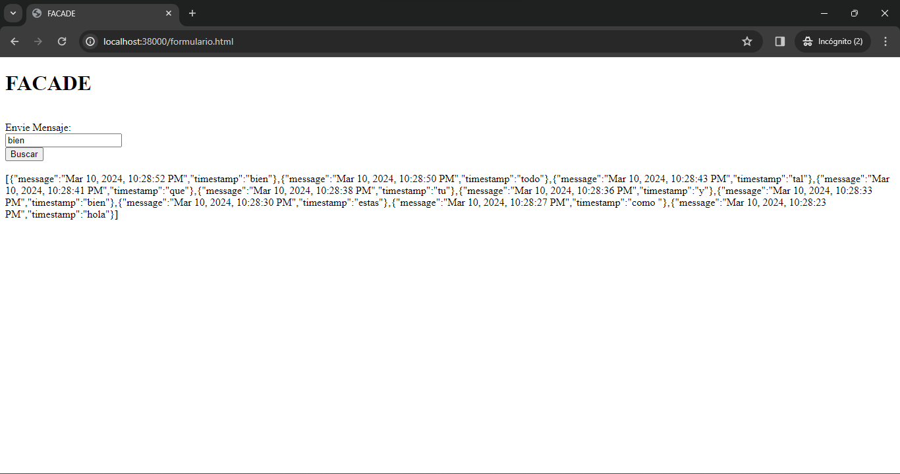
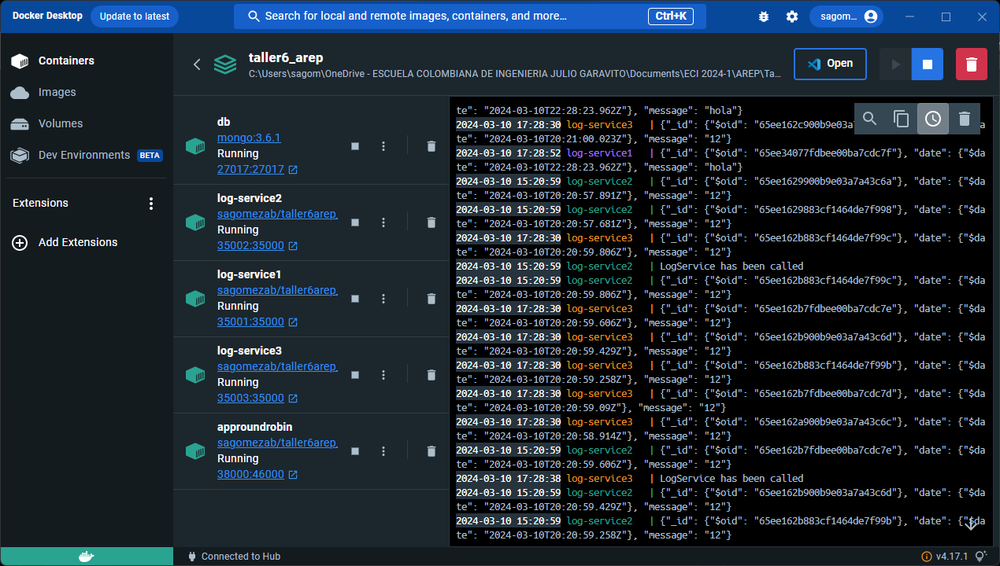
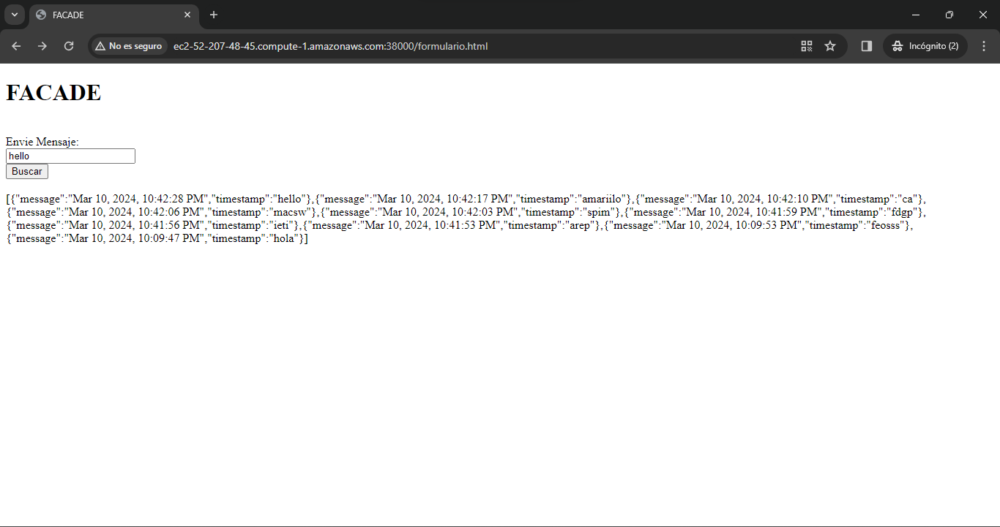
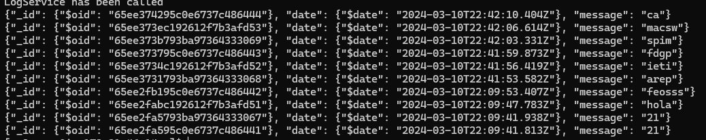

# TALLER 6: TALLER DE TRABAJO INDIVIDUAL EN PATRONES ARQUITECTURALES
#### Hecho por: Daniel Santiago Gómez Zabala

Se va a crear la siguiente arquitectura, usando una instancia EC2 de AWS y docker para los contenedores e imagenes correspondientes.



## GETTING STARTED

1. Debe tener instalado Maven en su computador para poder ejecutar los comandos que se le indicarán más adelante.
2. Debe contar con GITHUB para poder hacer uso del repositorio donde se alberga el laboratorio.
3. Debe tener un ambiente de java para poder visualizar y ejecutar el codigo.
4. Debe tener DOCKER para poder ejecutar los comando que se le indicarán más adelante

## INSTALLING

Debe clonar el respositorio para poder hacer uso de la app con el comando que se encuentra a continuación

```
https://github.com/sagomezab/Taller6_AREP.git
```

En este caso la clonación del repo ser para visualizar lo realizado y la ejecución de cada Tarea

## Test

### Prueba Local

Se crearon dos repositorio en DockerHub los cuales hacen referencia a **LogService** y a **LogServerFacade**, estas referencias se colocaron en el docker-compose para inicar los servicios al ejecutar docker-compose

Se realizaron la creación de los contenedores e imagenes correspondientes para poder ejecutarlo de forma local, los comando fueron los siguientes:

```
docker build -f .\DockerFile.logservice -t logservice .
docker tag logservice sagomezab/taller6arep_logservice
docker push sagomezab/taller6arep_logservice

docker build -f .\DockerFile.facade -t facadeservice .
docker tag facadeservice sagomezab/taller6arep_facade
docker push sagomezab/taller6arep_facade

docker-compose up -d
```
Después de haber realizado los comandos anteriores debe visualizar en docker lo siguiente:


En el compose se definio que la app se ecucharia por el purerto 38000, para ingresar de forma local debe usar el siguiente link:
```
http://localhost:38000/formulario.html
```
Debe visualizar algo como lo siguiente:

Al visualizar los logs del contendor creado comprobamos el uso y funcionamineto de roundrobin


### Prueba en AWS

Una vez tenga los repositorios en dockerhub con las imagenes correspondientes logservice y logserverfacade, debe ingresar a su instancia EC2.

Debe crear un red en docker para asegurar la eficienciad e la comunicación entre los contenedores

```
docker network create mynetwork
```
Además debe inicar a correr mongo con el siguiente comando:
```
docker run -d --network=mynetwork -p 27017:27017 --name db mongo
```
Corra las imagenes de logservice con los siguientes comando:
```
docker run -d --name log-service1 -p 35001:35000 --network mynetwork sagomezab/taller6arep_logservice
docker run -d --name log-service2 -p 35002:35000 --network mynetwork sagomezab/taller6arep_logservice
docker run -d --name log-service3 -p 35003:35000 --network mynetwork sagomezab/taller6arep_logservice
```
Y poner a correr la imagen de la fachada
```
docker run -d --name approundrobin -p 38000:46000 --network mynetwork sagomezab/taller6arep_facade
```
Una vez haya realizado eso y además haya abierto el puerto 38000 en su instancia de AWS debe poder probarlo con el siguiente link:
```
http://ec2-52-207-48-45.compute-1.amazonaws.com:38000/formulario.html
```
Debe visualizar lo siguiente:

Revise los logs de los tres service y verifique que se esta almacenando todo correctamente

## Clarifications and Desing

El proyecto cuenta con una clase llamada HttpServer que actúa como la fachada del servidor web, gestionando las solicitudes de los clientes y proporcionando un mecanismo para manejarlas. Esta clase también incluye un caché tolerante a concurrencia para almacenar las solicitudes al API externo y minimizar el tiempo y los recursos necesarios para futuras solicitudes.

Se ha simplificado la estructura del proyecto eliminando las interfaces de servicios REST y clases específicas para manejar recursos HTML, CSS, JavaScript e imágenes. Ahora, existe una clase llamada StaticFiles que gestiona las solicitudes y busca archivos estáticos en el disco del servidor, y otra clase llamada HttpResponse que configura los encabezados y el cuerpo de los paquetes HTTP a enviar.

Además, se ha añadido la capacidad de configurar manualmente servicios web tipo GET y POST mediante funciones lambda.

### Video

* [Video Probatorio](https://youtu.be/9ogxPgNB08w)

## Built With

* [Maven](https://maven.apache.org/) - Administrador de dependencias

## Version

1.0
## Author

Daniel Santiago Gómez Zabala [SAGOMEZAB](https://github.com/sagomezab)

## Acknowledgments

### MongoDB
MongoDB es una base de datos NoSQL caracterizada por su flexibilidad y escalabilidad. Se basa en el modelo de datos de archivos y permite el almacenamiento y la recuperación eficiente de datos. Algunas de las razones por las que se eligió MongoDB para este proyecto son:

* **Flexibilidad de esquema**: MongoDB no requiere un esquema fijo, lo que significa que los archivos de una colección pueden tener diferentes estructuras de datos. Esto facilita la actualización de la aplicación a medida que cambian los requisitos. 
* **Escalabilidad horizontal**: MongoDB es altamente escalable y puede distribuir datos entre múltiples servidores para manejar grandes volúmenes de datos y cargas de trabajo. 
* **Rendimiento**: MongoDB proporciona un alto rendimiento de lectura y escritura, adecuado para aplicaciones que requieren un rendimiento rápido de la base de datos.

### Docker
Docker es una plataforma de contenedores que le permite empaquetar, distribuir y ejecutar aplicaciones independientemente del entorno de ejecución. Algunas de las razones para utilizar Docker en este proyecto son:

* **Portabilidad**: los contenedores Docker encapsulan todas las dependencias y configuraciones necesarias para ejecutar una aplicación, lo que garantiza un funcionamiento coherente de la aplicación en cualquier entorno. 
* **Fácil de administrar**: Docker proporciona herramientas de administración de contenedores como Docker Compose que simplifican la implementación y administración de múltiples contenedores.
* **Aislamiento**: los contenedores Docker proporcionan un entorno aislado para la ejecución de aplicaciones, lo que garantiza que las aplicaciones no se afecten entre sí y proporciona seguridad adicional.

### Código
* **LogService.java** Utiliza un servicio web utilizando Spark Java que escucha en el puerto definido por la función getPort(). Cuando se recibe una solicitud en la ruta /logservice, se añade un mensaje a la base de datos MongoDB utilizando un objeto MssgDAO y se devuelve la lista de mensajes almacenados.
* **RemoteLogService.java** El método invoke recibe un argumento de mensaje, lo codifica y realiza una solicitud GET al servicio de registro en una de las instancias definidas en LOGSERVICEURL. Luego, cambia la instancia para distribuir las solicitudes entre los diferentes servicios de registro. Acá es donde funciona roundrobin en cada interación va aumentando la instancia las n veces que están definidas.

### AWS

Una instancia EC2 de Amazon Web Services (AWS) es un servidor virtual que puedes lanzar en la nube de AWS. Estas instancias te permiten ejecutar aplicaciones y trabajar con sistemas operativos de tu elección, en este caso fue Linux.